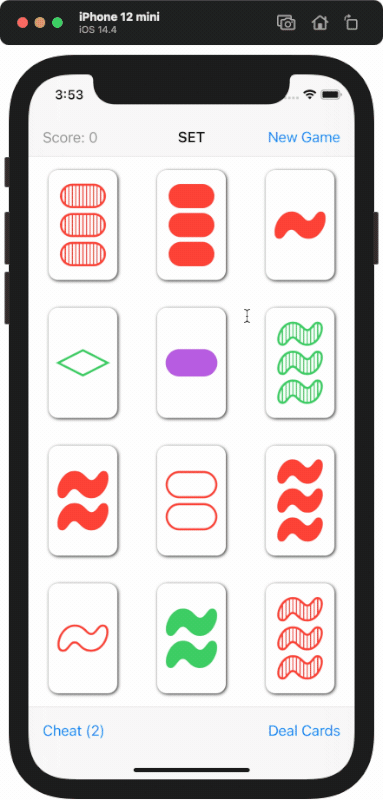

#  SET

This App is the result of me following lectures 1 – 6 of
»[Stanford CS193p - Developing Apps for iOS (Spring quarter 2020)](https://cs193p.sites.stanford.edu)«.

## Demo

## Warning

I'm quite new to `XCTest` and iOS development in general. If you spot something that should be improved
please let me know in the issue tracker.

## whoami

Hi, my name is Martin Hettiger and I come from Germany. You can [follow me on Twitter](https://twitter.com/martinHettiger) (en) if you want to 
see more stuff like this. Also [checkout my website](https://www.hettiger.com) (de) if you want to get in touch.
